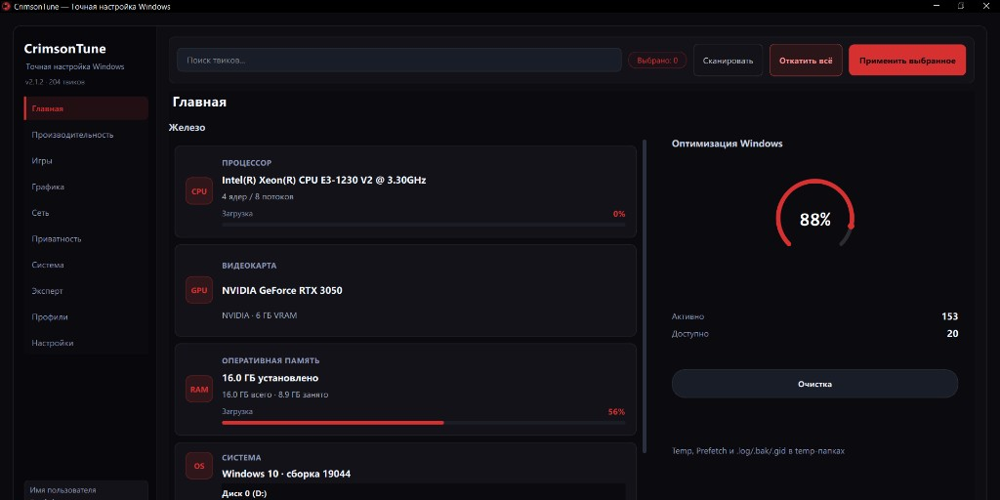

<p align="center">
  <a href="README.md"><strong>🇷🇺 Русский</strong></a>
  &nbsp;·&nbsp;
  <a href="README.en.md"><strong>🇬🇧 English</strong></a>
</p>

<p align="center">
  
</p>

<h1 align="center">CrimsonTune</h1>

<p align="center">
  <strong>Precise Windows 10 tuning</strong><br>
  <sub>Desktop optimizer · smart scan · profiles · Crimson Dark UI</sub>
</p>

<p align="center">
  <a href="https://github.com/expl01t-search/CrimsonTune/releases/latest">
    
  </a>
  <a href="https://github.com/expl01t-search/CrimsonTune/releases/latest">
    
  </a>
  <a href="https://github.com/expl01t-search/CrimsonTune/releases/latest">
    
  </a>
  <a href="https://github.com/expl01t-search/CrimsonTune/blob/main/requirements.txt">
    
  </a>
  <a href="https://github.com/expl01t-search/CrimsonTune/blob/main/LICENSE">
    
  </a>
</p>

<p align="center">
  <a href="https://github.com/expl01t-search/CrimsonTune/releases/latest/download/CrimsonTune-v2.1.2-win64.zip">
    
  </a>
</p>

---

## Why CrimsonTune

One tool instead of dozens of `.reg` files, batch scripts, and half-manual guides. CrimsonTune bundles proven tweaks from **WinUtil**, **Optimize #Expl01t**, **BoosterX**, **SpeedGuide**, **MSI Mode Utility**, and **SSD Mini Tweaker** — with revert, smart scanning, and profiles.

> Run as **Administrator** — tweaks touch registry, services, and the task scheduler.

> **Language:** Russian and English — **Settings → Language**.

---

## Highlights

<table>
<tr>
<td width="50%" valign="top">

### Performance
- CPU, RAM, services, power plan
- **SSD pack** (TRIM, defrag OFF, NTFS)
- SysMain, hibernation, prefetch off

### Gaming & network
- **MSI Mode High** (GPU / USB / LAN)
- MMCSS, per-NIC Nagle OFF, TCP ECN/CTCP
- Game tweaks and timer resolution

</td>
<td width="50%" valign="top">

### Graphics
- NVIDIA: P-State, MaxFrameLatency, driver perf
- DirectX / OpenGL / AMD (hardware-gated)

### Safe UI
- Risky tweaks under **Expert** tab
- Smart scan prevents duplicate toggles
- `.reg` export and full restore

</td>
</tr>
</table>

| | |
|---|---|
| **204 tweaks** | performance · SSD · gaming · graphics · network · privacy · system · expert |
| **10 tabs** | Home · Performance · Gaming · Graphics · Network · Privacy · System · Expert · Profiles · Settings |
| **5 profiles** | Balanced · Gamer Pro · Max Performance · Privacy · **SSD** |
| **Filters** | All · Available · Active · One-shot |
| **Crimson Dark** | Dark theme, animations, splash, auto-scan on launch |

---

## SSD optimization

Under **Performance**, the **SSD** subcategory includes SSD Mini Tweaker-style tweaks plus related NTFS settings:

| Tweak | Action |
|-------|--------|
| TRIM | `fsutil DisableDeleteNotify=0` on volumes |
| Prefetch / Superfetch OFF | Not needed on SSD |
| Defrag OFF | Service, scheduler, boot defrag |
| Layout.ini OFF | OptimalLayout + Prefetch scenario |
| Volume indexing OFF | WMI/CIM on fixed drives |
| System Restore OFF | Frees space (risk: high) |

The **SSD** profile also applies `ntfs_memory_ssd`, `large_system_cache_on`, `disable_paging_executive`, `ntfs_8dot3_off`, `disable_hibernation`, and more.

---

## Quick start

### Download

1. [**Releases**](https://github.com/expl01t-search/CrimsonTune/releases/latest)
2. `CrimsonTune-v*-win64.zip` — extract and run `CrimsonTune.exe` **as Administrator**
3. Each release includes `RELEASE_NOTES.md` (changelog for that version)

### From source

```bash
git clone https://github.com/expl01t-search/CrimsonTune.git
cd CrimsonTune
pip install -r requirements.txt
python main.py
```

### Build

```bash
pip install -r requirements-dev.txt
python tools/gen_icon.py
pyinstaller build.spec
```

→ `dist/CrimsonTune.exe`

### Dependencies

| File | Purpose |
|------|---------|
| `requirements.txt` | **Runtime only** — PySide6 and psutil |
| `requirements-dev.txt` | **Build & CI** — runtime deps + PyInstaller |

End users only need the `.zip` from Releases. Two files keep PyInstaller out of a simple `python main.py` setup.

> The `tests/` folder is not in the repository — keep it locally for development. Release archives contain only `CrimsonTune.exe`.

---

## Screenshots

<p align="center">
  
</p>

<p align="center"><sub>Home · CPU/GPU/RAM · optimization ring · quick cleanup</sub></p>

---

## Stack

| Layer | Technology |
|-------|------------|
| GUI | PySide6 + `cyber_forge.qss` |
| System | Python 3.11+, `winreg`, `psutil` |
| Build | PyInstaller |

---

## Restore

```bat
RESTORE.bat
```

or `python main.py --restore-all`

Data: `%AppData%\CrimsonTune` (migrates from VeloForge / WinTweaker).

---

## Changelog

[CHANGELOG.md](CHANGELOG.md)

---

<p align="center">
  <sub>Made for precise Windows tuning</sub><br>
  <a href="README.md">Читать на русском</a>
</p>
