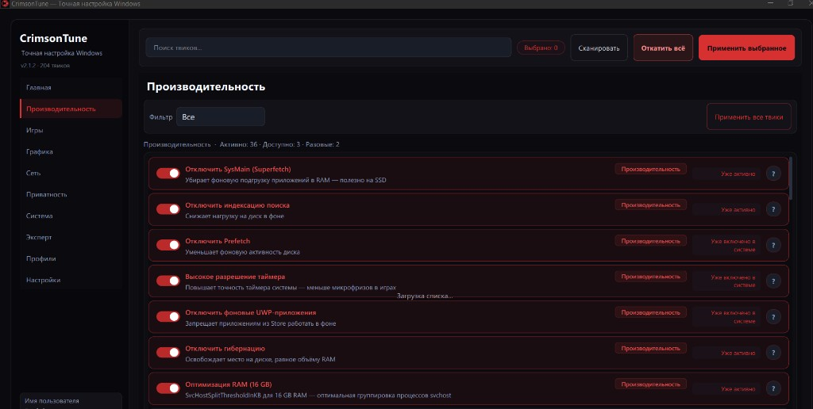
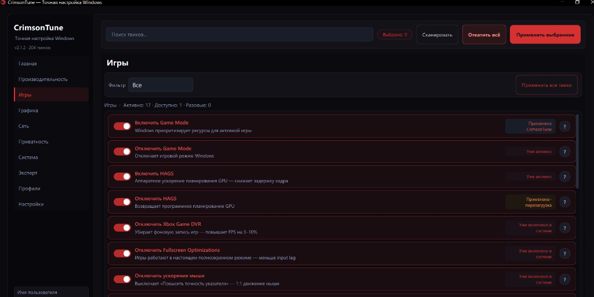
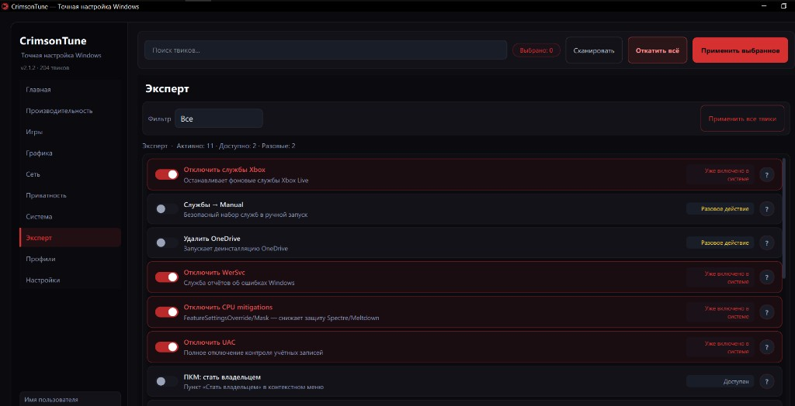
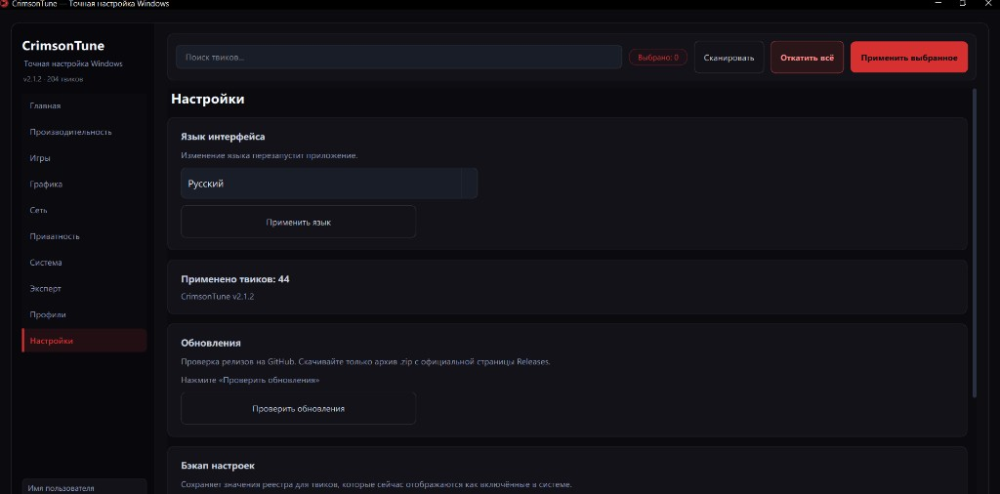

<p align="center">
  <a href="README.md"><strong>🇷🇺 Русский</strong></a>
  &nbsp;·&nbsp;
  <a href="README.en.md"><strong>🇬🇧 English</strong></a>
</p>

<p align="center">
  
</p>

<h1 align="center">CrimsonTune</h1>

<p align="center">
  <strong>Точная настройка Windows 10</strong><br>
  <sub>Desktop-оптимизатор · умное сканирование · профили · Crimson Dark UI</sub>
</p>

<p align="center">
  <a href="https://github.com/expl01t-search/CrimsonTune/releases/latest">
    
  </a>
  <a href="https://github.com/expl01t-search/CrimsonTune/releases/latest">
    
  </a>
  <a href="https://github.com/expl01t-search/CrimsonTune/releases/latest">
    
  </a>
  <a href="https://github.com/expl01t-search/CrimsonTune/blob/main/requirements.txt">
    
  </a>
  <a href="https://github.com/expl01t-search/CrimsonTune/actions/workflows/ci.yml">
    
  </a>
</p>

<p align="center">
  <a href="https://github.com/expl01t-search/CrimsonTune/releases/latest/download/CrimsonTune-v2.1.2-win64.zip">
    
  </a>
</p>

<p align="center">
  <a href="assets/screenshots/dashboard.png">
    
  </a>
</p>

<p align="center"><sub>Crimson Dark · кольцо оптимизации · умное сканирование · 204 твика</sub></p>

---

## Зачем CrimsonTune

Один инструмент вместо десятка `.reg`, `.bat` и полуручных гайдов. CrimsonTune собирает проверенные твики из **WinUtil**, **Optimize #Expl01t**, **BoosterX**, **SpeedGuide**, **MSI Mode Utility** и **SSD Mini Tweaker** — и даёт им понятный интерфейс с откатом, сканированием и профилями.

> Запускайте **от имени администратора** — твики работают с реестром, службами и планировщиком.

> **Язык:** русский и английский — **Настройки → Язык**.

---

## Что внутри

<table>
<tr>
<td width="50%" valign="top">

### Производительность
- CPU, RAM, службы, питание
- **SSD-пакет** (TRIM, дефрагментация OFF, NTFS)
- Отключение SysMain, hibernation, prefetch

### Игры и сеть
- **MSI Mode High** (GPU / USB / LAN)
- MMCSS, Nagle OFF на NIC, TCP ECN/CTCP
- Игровые твики и таймер

</td>
<td width="50%" valign="top">

### Графика
- NVIDIA: P-State, MaxFrameLatency, driver perf
- DirectX / OpenGL / AMD (по железу)

### Безопасность UI
- Опасные твики — вкладка **Эксперт**
- Умное сканирование: не включить дважды
- Экспорт `.reg` и полный откат

</td>
</tr>
</table>

| | |
|---|---|
| **204 твика** | performance · SSD · gaming · graphics · network · privacy · system · expert |
| **10 вкладок** | Главная · Производительность · Игры · Графика · Сеть · Приватность · Система · Эксперт · Профили · Настройки |
| **5 профилей** | Balanced · Gamer Pro · Max Performance · Privacy · **SSD** |
| **Фильтры** | Все · Доступные · Активные · Разовые |
| **Crimson Dark** | Тёмная тема, анимации, splash, автоскан при старте |

---

## SSD-оптимизация

На вкладке **Производительность** появилась подкатегория **SSD** — набор из SSD Mini Tweaker и связанных NTFS-твиков:

| Твик | Действие |
|------|----------|
| TRIM | `fsutil DisableDeleteNotify=0` на томах |
| Prefetch / Superfetch OFF | Не нужны на SSD |
| Дефрагментация OFF | Служба, планировщик, boot defrag |
| Layout.ini OFF | OptimalLayout + Prefetch scenario |
| Индексирование дисков OFF | WMI/CIM на фиксированных томах |
| Защита системы OFF | Освобождает место (risk: high) |

Дополнительно в профиле **SSD**: `ntfs_memory_ssd`, `large_system_cache_on`, `disable_paging_executive`, `ntfs_8dot3_off`, `disable_hibernation` и др.

---

## Быстрый старт

### Скачать

1. [**Releases**](https://github.com/expl01t-search/CrimsonTune/releases/latest)
2. Архив `CrimsonTune-v*-win64.zip` — распакуйте и запустите `CrimsonTune.exe` **от администратора**
3. К каждому релизу приложен `RELEASE_NOTES.md` (changelog этой версии)

### Из исходников

```bash
git clone https://github.com/expl01t-search/CrimsonTune.git
cd CrimsonTune
pip install -r requirements.txt
python main.py
```

### Сборка

```bash
pip install -r requirements-dev.txt
python tools/gen_icon.py
pyinstaller build.spec
```

→ `dist/CrimsonTune.exe`

### Зависимости

| Файл | Назначение |
|------|------------|
| `requirements.txt` | **Только для запуска** — PySide6 и psutil |
| `requirements-dev.txt` | **Сборка и CI** — подключает runtime + PyInstaller |

Обычным пользователям достаточно скачать `.zip` из Releases. Два файла — чтобы не тянуть PyInstaller тем, кто просто запускает `python main.py`.

> В репозитории нет папки `tests/` — она остаётся локально для разработки. В релизный архив попадает только `CrimsonTune.exe`.

---

## Скриншоты

<table>
<tr>
<td width="50%" valign="top" align="center">
  <a href="assets/screenshots/dashboard.png">
    
  </a>
  <br><strong>Главная</strong><br>
  <sub>CPU · GPU · RAM · диски · кольцо 88%</sub>
</td>
<td width="50%" valign="top" align="center">
  <a href="assets/screenshots/performance.png">
    
  </a>
  <br><strong>Производительность</strong><br>
  <sub>SysMain · Prefetch · SSD · таймер · RAM</sub>
</td>
</tr>
<tr>
<td width="50%" valign="top" align="center">
  <a href="assets/screenshots/games.png">
    
  </a>
  <br><strong>Игры</strong><br>
  <sub>Game Mode · HAGS · DVR · бейдж «перезагрузка»</sub>
</td>
<td width="50%" valign="top" align="center">
  <a href="assets/screenshots/expert.png">
    
  </a>
  <br><strong>Эксперт</strong><br>
  <sub>Xbox · UAC · mitigations · разовые действия</sub>
</td>
</tr>
<tr>
<td colspan="2" align="center">
  <a href="assets/screenshots/settings.png">
    
  </a>
  <br><strong>Настройки</strong><br>
  <sub>RU / EN · автообновление · бэкап реестра · откат</sub>
</td>
</tr>
</table>

---

## Стек

| Слой | Технология |
|------|------------|
| GUI | PySide6 + `cyber_forge.qss` |
| Система | Python 3.11+, `winreg`, `psutil` |
| Сборка | PyInstaller |

```
CrimsonTune/
├── core/       # приложение, сканер, бэкапы, i18n
├── tweaks/     # performance, ssd, nvidia, msi_mode, expert…
├── ui/         # окна, компоненты, тема
├── config/     # tweaks.json, профили (в т.ч. ssd.json)
└── locales/    # RU / EN
```

---

## Восстановление

```bat
RESTORE.bat
```

или `python main.py --restore-all`

Данные: `%AppData%\CrimsonTune` (миграция из VeloForge / WinTweaker).

---

## Changelog

[CHANGELOG.md](CHANGELOG.md)

---

<p align="center">
  <sub>Сделано для точной настройки Windows</sub><br>
  <a href="README.en.md">Read in English</a>
</p>
